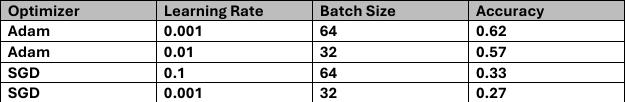

# ImageProject

Clone the Repository
Use git to clone your repository:

bash
Copy code
# Clone the ImageProject repository
`git clone <https://github.com/Ahmad-AlaaEdin/ImageProject.git>`

# Navigate to the project folder
`cd ImageProject`

# Reproducing the Experiments.

```
adam = tf.keras.optimizers.Adam(learning_rate=0.01)
sgd = tf.keras.optimizers.SGD(learning_rate=0.001)
model.compile(optimizer="adam",
               loss="sparse_categorical_crossentropy",
              metrics=['accuracy'])

BATCH_SIZE = 64
```

### Adjust the learning rates of the optimizers according to the values specified in the image

